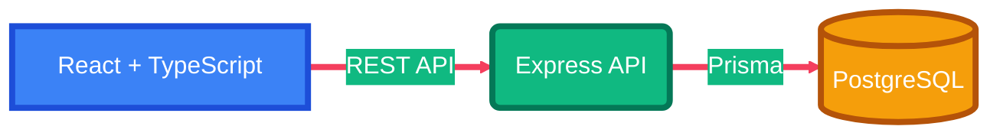

<div align="center">
  

  <h1>MittArv HRMS</h1>
  <h3>Frontend</h3>

  <p>
    An open-source Human Resource Management System for organizations that need
    employee records, leave, attendance, payroll, and access control — without
    locking themselves into a vendor.
  </p>

  <p>
    <a href="https://github.com/mittarv/hrms-frontend/stargazers"></a>
    <a href="LICENSE"></a>
    <a href="https://github.com/mittarv/hrms-frontend/pulls"></a>
    <a href="https://nodejs.org/"></a>
    <a href="https://react.dev/"></a>
    <a href="https://www.typescriptlang.org/"></a>
  </p>

  <p>
    <a href="https://hrms.dev.mittarv.com">Live SaaS</a>
    ·
    <a href="https://github.com/mittarv/hrms-backend">Backend</a>
    ·
    <a href="#-getting-started">Getting started</a>
    ·
    <a href="#-contributing">Contributing</a>
  </p>
</div>

---

## Why MittArv HRMS

Most HR tools are either rigid enterprise suites or spreadsheets pretending to be software. MittArv HRMS is built as a **modular, self-hostable product**: you run it, you own the data, and you can change the modules that matter to you.

This repository is the **web client**. The API lives in [`hrms-backend`](https://github.com/mittarv/hrms-backend).

> The previous codebase is preserved on [`old-code`](https://github.com/mittarv/hrms-frontend/tree/old-code). `main` is a from-scratch rewrite with a cleaner module layout.

## Try it

| Path | What you get |
| --- | --- |
| [SaaS demo](https://hrms.dev.mittarv.com) | Hosted product, no install |
| Self-host (this repo) | Full source, local or your own servers |

## Features

<p align="center">
  
</p>

### People

- **Dashboard** — leaves, birthdays, work anniversaries, and org updates in one view
- **Employee directory** — grid and card views, job history, contacts, salary records
- **Onboarding & offboarding** — hire workflows plus HR and finance clearance

<p align="center">
  
</p>

### Time and pay

- **Leave & attendance** — configurable leave types, balances, holidays, and calendars
- **Payroll** — salary components, monthly runs, adjustments, and payslips
- **Requests** — a single inbox for leave, profile edits, extra work, and location changes

<p align="center">
  
</p>

### Culture and control

- **Rewards & recognition** — nominations, voting, winners, and payroll hooks
- **Policies & links** — company knowledge that employees can actually find
- **RBAC** — roles and permissions, including sensitive fields such as salary
- **Multi-org** — more than one company or branch on a single deployment

<p align="center">
  
</p>

## Architecture



| Layer | Stack |
| --- | --- |
| UI | React 19, TypeScript, Vite |
| API | Node.js, Express, TypeScript |
| Data | PostgreSQL (Prisma) |

Frontend feature folders match backend modules (`employees`, `leave`, `payroll`, …) so contributors can work on one domain end to end.

## Getting started

**Requirements:** [Node.js](https://nodejs.org/) 22+ and npm 10+. Run the [backend](https://github.com/mittarv/hrms-backend) on port `5000` for API calls.

```bash
git clone https://github.com/mittarv/hrms-frontend.git
cd hrms-frontend
cp .env.example .env
npm install
npm run dev
```

Open [http://localhost:3000](http://localhost:3000). Vite proxies `/api` to `http://localhost:5000`.

### Environment

```env
VITE_API_BASE_URL=http://localhost:5000
```

Copy `.env.example` — never commit `.env`.

### Scripts

| Command | Description |
| --- | --- |
| `npm run dev` | Development server with HMR |
| `npm run build` | Type-check and production build |
| `npm run preview` | Serve the production build locally |
| `npm run lint` | Lint the project |

## Project structure

```text
hrms-frontend/
├── public/              # Static files
├── src/
│   ├── app/             # App shell and providers
│   ├── assets/          # Images and icons
│   ├── lib/             # API client and shared helpers
│   ├── modules/         # Feature modules (employees, leave, payroll, …)
│   └── ui/              # Reusable components
├── .env.example
└── package.json
```

## Contributing

This project is open source and PRs are welcome.

1. Fork the repo and create a branch from `main`
2. Keep changes inside the module they belong to
3. Run `npm run lint` and `npm run build`
4. Open a pull request that explains **why** the change exists

Found a bug or want a feature? [Open an issue](https://github.com/mittarv/hrms-frontend/issues).

## Security

Do not file security issues in public GitHub issues. Email [support@mittarv.com](mailto:support@mittarv.com).

## License

[GNU Affero General Public License v3.0 or later](LICENSE).

You can self-host and modify MittArv HRMS. If you run a modified version as a network service, the AGPL requires you to share those changes with your users.

## Support

- Issues: [github.com/mittarv/hrms-frontend/issues](https://github.com/mittarv/hrms-frontend/issues)
- Email: [support@mittarv.com](mailto:support@mittarv.com)
- API: [github.com/mittarv/hrms-backend](https://github.com/mittarv/hrms-backend)
